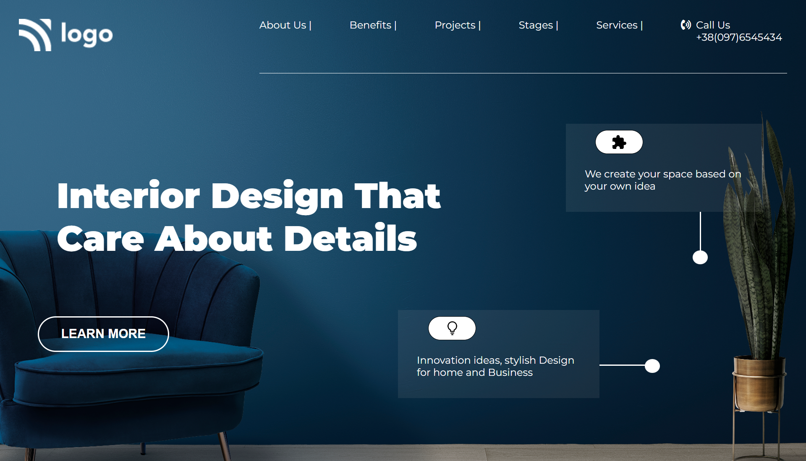

# Project |Interior-Design  

_by Tasmiya 💗_

### 🔗*Live Link* -: [ Interior-Design](https://tasmiya-proj-10.netlify.app)

## Technologies used

- HTML
- CSS

## 💡 What I have learn ?

- I learned how to use HTML and CSS to create a beautiful website.
- Learned to use CSS Box Sizing and backdround-size.
- This project gave me indepth knowledge & good learning experience.
- I learned about the ways of positioning elements in the HTML and CSS.

## This project took around 6 hours to complete 😊.
